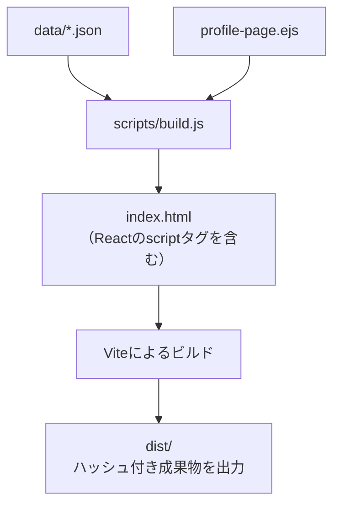

## 📁 ディレクトリ構成（概要）

```
.
├── public/                   # ブラウザが直接参照する静的ファイル（faviconなど）
│   └── favicons
├── src/                      # 開発対象のソースコード（EJS/スタイル/React/データ）
│   ├── assets/               # Reactでimportされる画像などの静的リソース（ビルド時にハッシュ付き出力）
│   ├── data/                 # スキルや資格などのJSONデータ
│   ├── styles/               # CSS（EJSでもReactでも利用可）
│   ├── templates/            # EJSテンプレート（HTML構造）
│   │   ├── components/       # 再利用可能なHTMLコンポーネント
│   │   └── profile-page.ejs  # ページ本体のテンプレート
│   └── react/                # ReactによるUIコンポーネント（段階的に導入中）
│       ├─ components/        # 各セクション単位で整理されたReactコンポーネント群
│       │   ├── profile/      # プロフィール（画像・名前・基本情報など）
│       │   ├── overview/     # 概略セクション
│       │   ├── career/       # 経歴セクション （今後追加予定）
│       │   ├── skills/       # スキル・資格セクション（今後追加予定）
│       │   ├── research/     # 研究経験セクション（今後追加予定）
│       │   └── interest/     # 興味・関心セクション（今後追加予定）
│       └── entrypoints/      # Reactのマウント処理（DOM要素に動的挿入）
├── scripts/                  # EJSビルド用のNode.jsスクリプト
│   └── build.js
├── dist/                     # Viteによる最終ビルド成果物（ハッシュ付き・デプロイ用）
├── index.html                # EJSビルドで生成されたHTML（編集不要）
├── package.json
└── vite.config.js            # Vite設定（デフォルトベース）
```

## ⚙️ 開発環境の特徴

- `scripts/build.js` により JSON データを EJS に流し込んで静的 HTML を生成
- 一部コンポーネント（例：プロフィール画像）を React により動的にレンダリング
- Vite による開発サーバー＆本番ビルド最適化（画像や JS はハッシュ付き）
- `nodemon` によって EJS・CSS・JSON の変更を検知して再ビルド
- `@` エイリアスを設定しており、`@/assets/xxx.jpg` のように `src/` 配下を簡潔に参照可能（Vite の `resolve.alias` を使用）

## 🧱 使用パッケージ（devDependencies）

- `ejs`: テンプレートエンジン（静的 HTML 生成）
- `vite`: 高速ビルドツール
- `react`: react-dom: 最小限の React 導入（部分的に使用）
- `@vitejs/plugin-react`: React 対応の Vite プラグイン
- `nodemon`: ファイル変更監視と自動ビルド
- `fs/promises`: JSON の読み込みに使用（Node.js 標準）

## 🧩 スクリプトの役割

| スクリプト                    | 概要                                                   |
| ----------------------------- | ------------------------------------------------------ |
| `scripts/build.js`            | EJS + JSON で `index.html` を生成                      |
| `src/react/components/*.jsx`  | UI パーツの実体（プロフィール画像など）                |
| `src/react/entrypoints/*.jsx` | 各 UI を DOM にマウントする処理（ReactDOM.createRoot） |

## 🧾 JSON によるデータ管理

- `src/data/*.json` に、資格やスキルデータを定義
- `scripts/build.js` が読み込み → `profile-page.ejs`に流し込み
- 構造を保ったまま内容の更新・多言語対応などが可能

※ 将来的に経歴も同様に JSON から管理する構成に拡張予定。

## 🚀 セットアップとコマンド

### 初期セットアップ

```bash
npm install
```

### 開発用サーバーの起動

```bash
npm run watch
```

- `.ejs`, `.css`, `.json` の変更を検知して自動再ビルド
- ブラウザの`localhost:5173`に即時反映
- React コンポーネントも動的にレンダリング

### 本番用ビルド

```bash
npm run build
```

- EJS + JSON によって`index.html`を生成
- さらに Vite によって、画像やスタイル、JS を含む最終生活物を`dist/に出力。

## 📜 npm scripts 一覧

| コマンド        | 説明                                                                  |
| --------------- | --------------------------------------------------------------------- |
| `npm run watch` | `src/` 配下の `.ejs`/`.css`/`.json` を監視し自動ビルド + サーバー起動 |
| `npm run build` | 静的 HTML 生成 + Vite による最終ビルド                                |
| `npm run dev`   | `watch` 内部で使用：Vite + ビルドスクリプトの連携起動                 |

## 🏗️ public と dist の違い

| ディレクトリ | 目的                                                      |
| ------------ | --------------------------------------------------------- |
| `public/`    | favicon などブラウザが直接参照するファイルのみ            |
| `dist/`      | 本番用ビルド成果物（画像や CSS はハッシュ付き、最適化済） |

## 🧩 技術補足：EJS・React・JSON の連携

このプロジェクトでは、**EJS で静的 HTML を生成しつつ、一部領域を React で動的に描画**しています。
さらに、資格・スキル・名言などのデータはすべて JSON で管理されており、テンプレートとデータを分離した柔軟な構成となっています。

### ① React のマウント構成（例）

React パーツは `src/react/mount*.jsx` で定義され、以下のように EJS テンプレート内の `id` を指定した DOM にマウントされます。

**例：プロフィール画像のマウント**

```jsx
// src/react/entrypoints/mountProfile.jsx
const container = document.getElementById("react-profile");
if (container) {
  ReactDOM.createRoot(container).render(<ProfileImage />);
}
```

```html
<!-- profile-page.ejs -->
<div id="react-profile"></div>
<script
  type="module"
  src="/src/react/entrypoints/mountProfile.jsx"
></script>
```

各 `mount*.jsx` は必要な DOM 要素があれば動的に React コンポーネントをマウントします。
これは EJS テンプレートで明示的に `<script type="module" src="...">` を記述することで、Vite にバンドルされ、実行されます。

### ② ビルド構成：EJS → index.html → Vite

1. `scripts/build.js` が `src/templates/profile-page.ejs` をレンダリングし、`index.html` を出力
2. テンプレートには React マウント用の `<script type="module" src="...">` が静的に記述されており、そのまま HTML に出力される
3. Vite は `index.html` をエントリーポイントとして、React や CSS、画像等を最終ビルドに含める

   **図解フロー：**



`index.html` は手動で編集せず、テンプレートで管理します。

### ③ JSON データとテンプレート展開の例

**skills.json の構造（抜粋）**

```json
[
  {
    "name": "AI / ML / DS",
    "items": [
      { "name": "NumPy", "level": 80 },
      { "name": "TensorFlow", "level": 80 }
    ]
  }
]
```

**skills.ejs（展開例）**

```ejs
<% for (const category of skills) { %>
  <h4><%= category.name %></h4>
  <ul>
    <% for (const skill of category.items) { %>
      <li>
        <%= skill.name %>
        <div class="skill-bar">
          <div style="width: <%= skill.level %>%"></div>
        </div>
      </li>
    <% } %>
  </ul>
<% } %>
```

このように、JSON データの構造をそのまま EJS で展開することで、構造変更や多言語対応にも柔軟に対応できます。

※ `scripts/build.js` は現在、`skills.json`, `certifications.json`, `quotes.json` を読み込んでいます。

## 💡 拡張ポイント

- JSON を用いたデータ分離により、保守性・多言語対応・柔軟なテンプレート変更が容易
- 画像や UI を React コンポーネントとして段階的に移行可能（現在一部導入済み）
- src/assets/ の画像は import されると Vite により自動で dist/assets/ にハッシュ付き出力される
- TailwindCSS や Sass の導入、PWA 対応も容易
- EJS → React の完全移行も自然に進められる構成

## 🌍 デプロイ

Vercel にて公開中：
🔗 https://kodera-kanare.vercel.app
